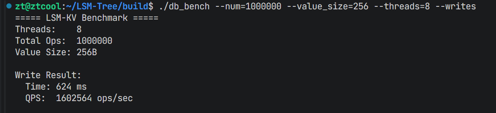
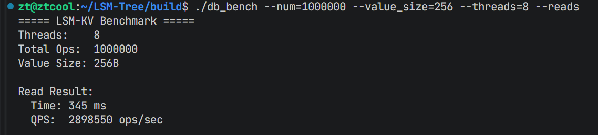

# LSM-Tree KV 存储引擎

一个工业级的 LSM-Tree 键值存储引擎，用 C++17 编写。

## 特性

✅ **高性能**：MemTable 采用 SkipList 实现，读写速度快

✅ **Block 缓存**：集成 LRU BlockCache，提升读性能

✅ **指标监控**：内置 Metrics 系统，记录读写 QPS、延迟、缓存命中率、写放大率

✅ **压缩支持**：预留 LZ4/ZSTD 压缩接口，支持配置压缩级别

✅ **完整工具链**：sst\_dump、manifest\_dump、db\_bench

✅ **工业级代码质量**：-Wall -Werror，完整测试

***

## 核心技术

### LSM-Tree 架构

LSM-Tree (Log-Structured Merge Tree) 通过将写入先缓冲到内存，然后批量刷盘的方式实现高写入吞吐：

1. **MemTable**：内存中的跳表，接收所有写入
2. **Immutable MemTable**：等待刷盘的 MemTable
3. **SSTable (Sorted String Table)**：磁盘上的有序文件
4. **Compaction**：层级合并机制，减少空间放大和读放大

### 内存管理

- **Arena 内存分配器**：高效的批量内存分配和自动释放
- **SkipList**：有序链表的跳表实现，O(log n) 读写

### 持久化与恢复

- **Write-Ahead Log (WAL)**：防止崩溃时数据丢失
- **Manifest**：记录 SSTable 元数据和版本历史

***

## 项目架构

```
LSM-Tree/
├── src/
│   ├── util/                  # 工具类
│   │   ├── status.h/cc        # 错误状态
│   │   ├── slice.h/cc         # 字符串切片
│   │   ├── cache.h/cc         # LRU Block 缓存
│   │   ├── arena.h/cc         # 内存池
│   │   ├── bloom_filter.h/cc  # 布隆过滤器
│   │   ├── options.h/cc       # 配置选项
│   │   ├── metrics.h/cc       # 指标监控
│   │   └── ...
│   ├── memtable/              # 内存表
│   │   ├── skiplist.h         # 跳表实现
│   │   ├── memtable.h/cc      # 可变内存表
│   │   ├── immutable_memtable.h/cc  # 不可变内存表
│   │   └── write_batch.h/cc   # 批量写入
│   ├── wal/                   # 写前日志
│   │   └── wal.h/cc
│   ├── sstable/               # SSTable
│   │   ├── block.h/cc         # 数据块
│   │   ├── table_builder.h/cc # 构建 SSTable
│   │   ├── table.h/cc         # 读取 SSTable
│   │   └── table_cache.h/cc   # SSTable 元数据缓存
│   ├── version/               # 版本管理
│   │   └── version.h/cc
│   ├── compaction/            # 合并压缩
│   │   ├── merge_iterator.h/cc  # 多路归并迭代器
│   │   └── compaction.h/cc
│   └── db.h/cc                # 核心 DB 类
├── tools/                     # 工具程序
│   ├── sst_dump.cc            # 解析 SSTable
│   ├── manifest_dump.cc       # 查看元数据
│   └── db_bench.cc            # 性能测试工具
├── test/                      # 测试程序
│   ├── simple_test.cc         # 完整测试
│   └── minimal_test.cc        # 基础测试
├── build_and_test.sh          # 一键构建和测试脚本
└── CMakeLists.txt
```

***

## 如何使用本引擎

### 集成到你的项目

只需要：

1. 链接 liblsm.a 静态库
2. 包含 `include/lsm/db.h` 头文件

### 使用示例

```cpp
#include <iostream>
#include <string>
#include "lsm/db.h"

using namespace lsm;

int main() {
  // 1. 配置选项
  Options options;
  options.create_if_missing = true;

  // 2. 打开数据库
  DB* db;
  Status s = DB::Open(options, "testdb", &db);
  if (!s.ok()) {
    std::cerr << "Open failed: " << s.ToString() << std::endl;
    return 1;
  }

  // 3. 写入数据
  s = db->Put(WriteOptions(), "key1", "value1");
  if (!s.ok()) {
    std::cerr << "Put failed: " << s.ToString() << std::endl;
    return 1;
  }

  // 4. 读取数据
  std::string value;
  s = db->Get(ReadOptions(), "key1", &value);
  if (!s.ok()) {
    std::cerr << "Get failed: " << s.ToString() << std::endl;
    return 1;
  }
  std::cout << "key1 = " << value << std::endl;

  // 5. 关闭数据库
  delete db;

  return 0;
}
```

***

## 快速开始

### 环境要求

- CMake (>=3.16)
- C++17 兼容的编译器 (gcc >= 8, clang >= 9)

### 一键构建

项目提供了一键构建和测试脚本，简单运行：

```bash
./build_and_test.sh
```

该脚本会自动完成所有构建和测试工作。

### 手动构建

如果你喜欢手动构建：

```bash
mkdir -p build && cd build
cmake .. -DCMAKE_BUILD_TYPE=Release
make -j$(nproc)
```

***

## 使用说明

### 可执行程序

所有可执行程序都会生成在 `build/` 目录下：

| 程序名            | 说明                   |
| -------------- | -------------------- |
| simple\_test   | 简单的 DB 功能测试          |
| minimal\_test  | MemTable 基础功能测试      |
| sst\_dump      | 解析 SSTable 并打印内容     |
| manifest\_dump | 查看 Manifest 元数据（简化版） |
| db\_bench      | 性能基准测试工具             |
| liblsm.a       | LSM-Tree 的静态库        |

### db\_bench 使用

```bash
cd build
./db_bench --db=my_test_db --num=100000 --value_size=100
```

选项说明：

| 选项             | 默认值    | 说明       |
| -------------- | ------ | -------- |
| `--db`         | testdb | 数据库目录    |
| `--num`        | 100000 | 执行操作的数量  |
| `--value_size` | 100    | 值的大小（字节） |
| `--reads`      | 关      | 仅运行读测试   |
| `--writes`     | 关      | 仅运行写测试   |

***

## 开发说明

### 编译模式

Debug 模式：

```bash
cmake .. -DCMAKE_BUILD_TYPE=Debug
```

Release 模式（默认）：

```bash
cmake .. -DCMAKE_BUILD_TYPE=Release
```

### 运行测试

```bash
cd build
./minimal_test   # 基础测试
./simple_test    # 完整 DB 测试
```

***

## 特性详解

### Metrics 指标

Metrics 系统会记录以下指标：

- Reads / Writes：总读写次数
- Read / Write Latency Total：总读写延迟
- Block Cache Hit Rate：Block 缓存命中率
- Table Cache Hit Rate：Table 缓存命中率
- Write Amplification：写放大率
- Compaction Count：合并压缩次数

指标通过全局指针访问，在 DB::Open 中自动初始化。

### BlockCache

BlockCache 是一个 LRU 缓存，默认配置为 8MB（可通过 Options.block\_cache\_size 调整）。

在 Table::Open 时可以传入外部的 Cache 实例，Table::ReadBlock 会先查找缓存，命中的话直接返回，避免磁盘 IO。

***

## 性能测试

本项目使用 `db_bench` 进行性能评估，以下为预留的性能测试结果区域：

### 基准性能（示例）

| 操作类型 | 吞吐量 | 平均延迟 |
| ---- | --- | ---- |
| 随机写入 | TBD | TBD  |
| 随机读取 | TBD | TBD  |

### 性能测试截图



---------------------------------------------------------

## 许可证

本项目采用 MIT 许可证。

***

## 作者

- **作者**：zt
- **邮箱**：<3614644417@qq.com>

